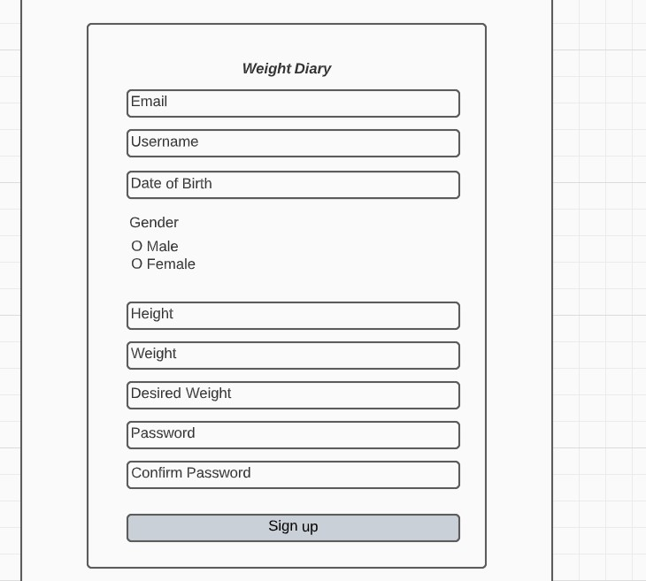
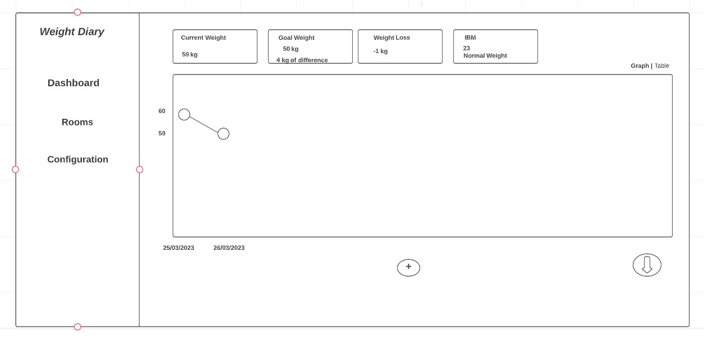
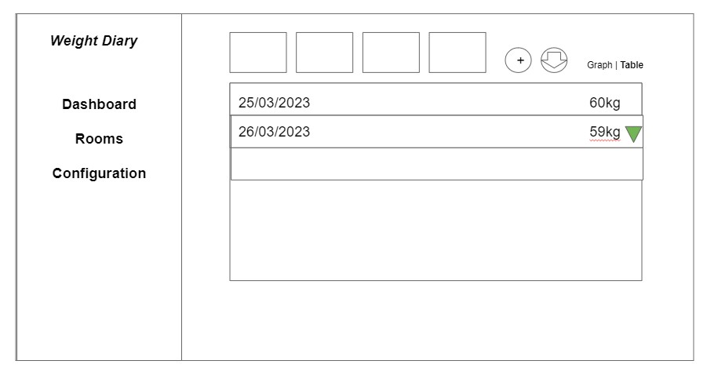
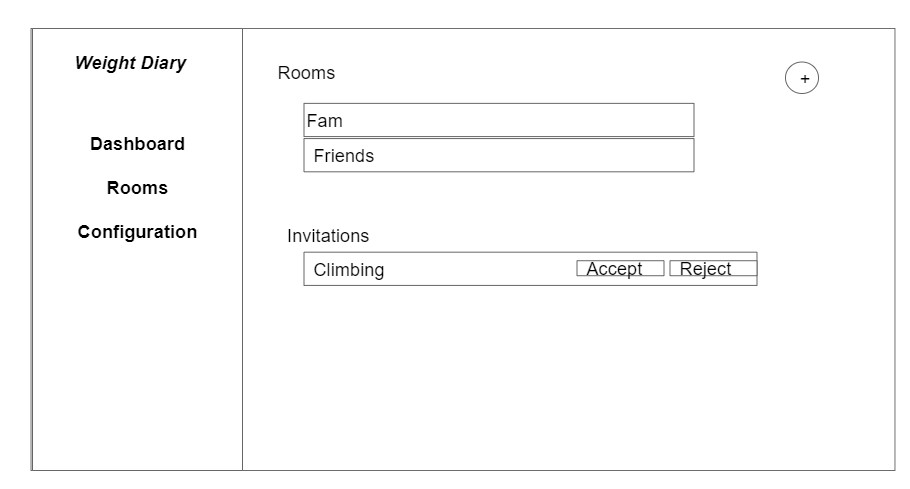
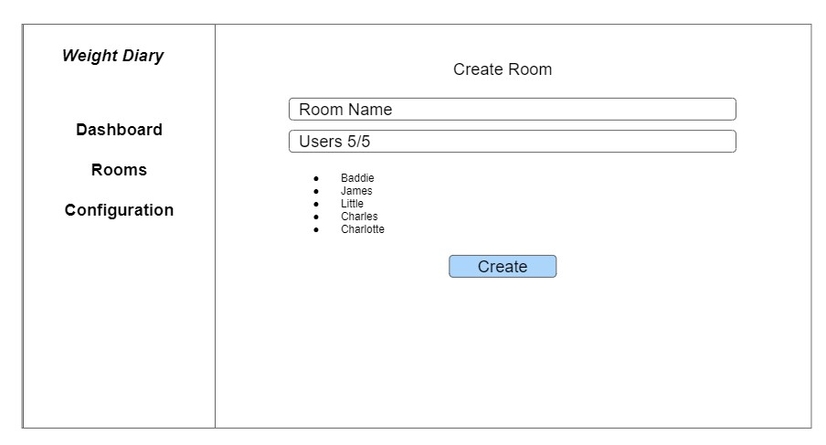
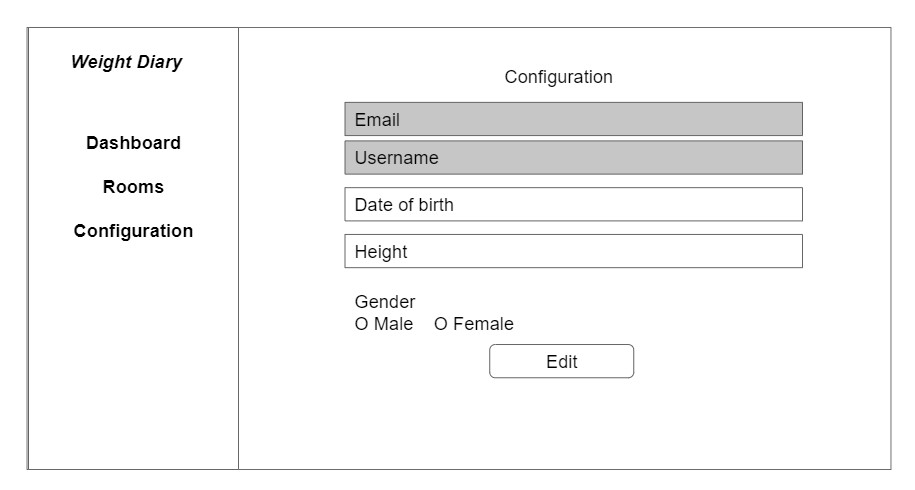
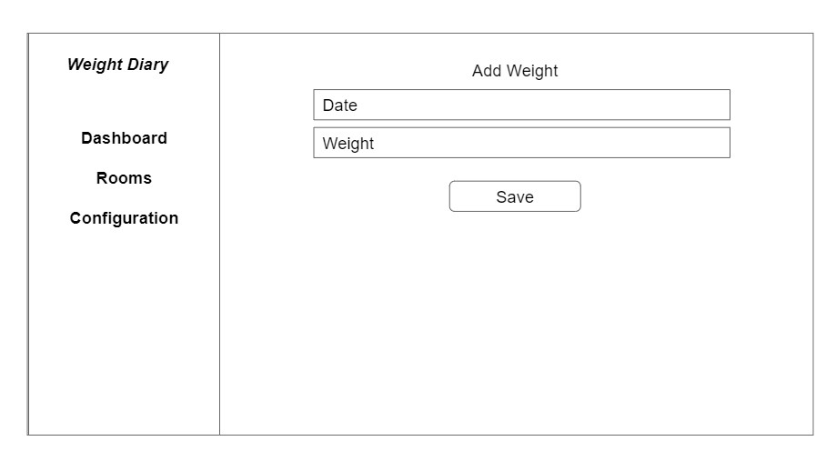
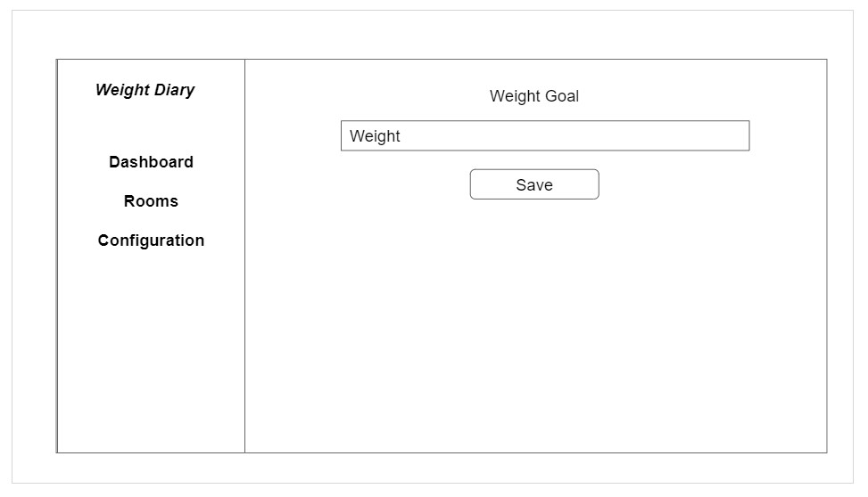
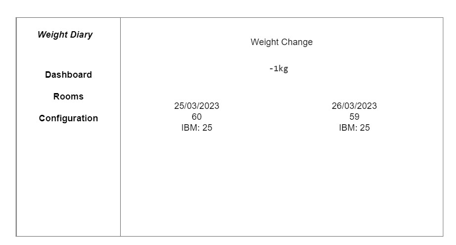
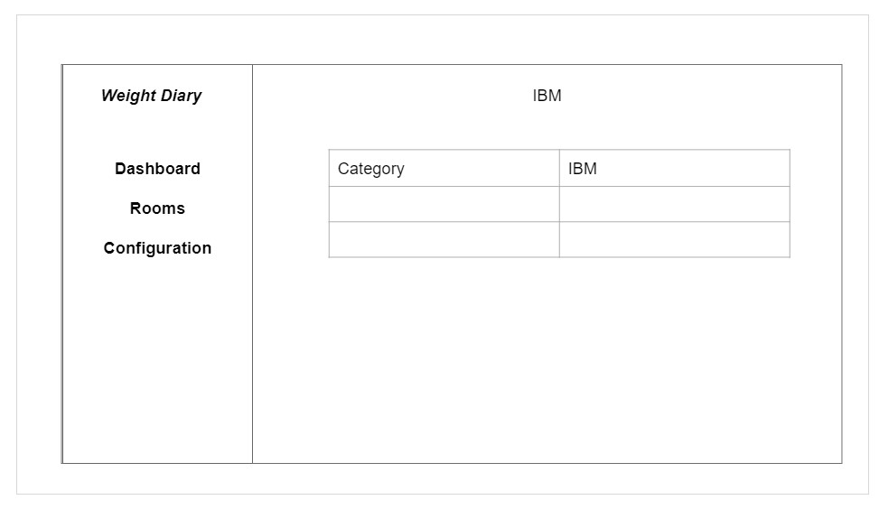

## Weight Diary  

### Table of contents
- [Weight Diary](#weight-diary)
  - [Table of contents](#table-of-contents)
  - [Introduction](#introduction)
  - [Wireframes](#wireframes)

### Introduction
The purpose of this web application is to track the daily changes of the user's weight. The user will have a dashboard where there is going to be a line graph with the reported daily weight. Also, the app will indicate its IBM, total weight loss, the desired weight of the user and how much difference there is with its current weight. But the feature that I'm most interested in developing is being able to share this information with friends and family who are also using this app and compare our daily metrics so we can motivate each other in our weight loss process.

This README will be used, for now, as documentation for the development, when the app is ready to be deployed this document will change to be the documentation for the usage of the app.

The technology that I'm going to use for this project is Mongo, Express, Angular and Node.

###User Stories
- The user can watch the daily recordings of its weight in a graph
- The user can download as an excel the information of the graph
- The user can record a new weight each day
- The user can create Rooms where he can invite other users to compare their weight track
- The user can accept to be part of a Room
- The user can see a graph with his weight and of the other members of the Room
- The user can see tables with his weight and of the other members of the Room

### Wireframes
####Login

There are going to be few approved users to try this website, it is not going to work for everybody for now.

Errors - The username/email could not be found

####Sign Up

We need this info to create an account for the user and keep his tracking on the database and to calculate the IBM.

Errors - A missing field, all the fields will be required and will have their own personalized error that will appear maybe below its input. 

####Dashboard
The dashboard will show the graph with the daily weight, if a weight is not recorded then we would just jump that day. 
Above the graph it will show the current weight, below the graph there is a button to add a new weight, this square and that button redirects to the New Weight screen. 
If you click on the Goal Weight square it will redirect you to the Goal Weight screen where you can change your goal. 
The weight loss square will redirect you to the Weight Loss page where it will show you the difference between the first record and the current one
The IBM square will take you to a page that shows you the IBM classifications.
There is also a download button that converts the graph into an Excel file.
You can also decide if you want to see the data as a graph or Table

The table version will also have the same four squares with data of the Graph version and the buttons to add and download.
The table will shows rows with the date, kgs and a symbol to show if the weight is going up or down, maybe it can also show the difference there.

####Rooms

The Rooms page with list the Rooms that you are part of, it will also have a button so you can create a new room and it is here where you can see your invitations to other Rooms

You will need to give the room a name and there will be a search bar to add the valid users to the group, the max number of users is 5.

####Configuration

I think the Email and Username should stay the same and the rest of the fields can be modified.

####Add Weight

Maybe this can be a modal. The default date will be the current date, but you can change it if you want add weights from the past

####Weight Goal

Yeah, definitely these screens need to be modals because the fields dont justify a complete new page.

####Weight Change

Also modal. It shows the difference between the first weight record and the current one.

####IBM

Modal. Shows a table with the IBM categories.